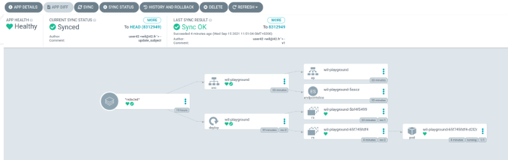

# Inception-of-Things (IoT)

A System Administration project introducing Kubernetes with **K3s, K3d, Vagrant, Argo CD**, and **GitLab**.

## Overview

| Part      | Description                    | Tools                  |
| --------- | ------------------------------ | ---------------------- |
| **p1**    | Two-node K3s cluster           | Vagrant, K3s, kubectl  |
| **p2**    | Three web apps with Ingress    | Vagrant, K3s, Traefik  |
| **p3**    | GitOps deployment with Argo CD | Docker, K3d, Argo CD   |
| **bonus** | Local GitLab + Argo CD         | Helm, Helmfile, GitLab |

---

# Part 1: K3s and Vagrant

Two Vagrant VMs are created:

| Machine     | Role       | IP               |
| ----------- | ---------- | ---------------- |
| `<login>S`  | K3s server | `192.168.56.110` |
| `<login>SW` | K3s agent  | `192.168.56.111` |

### Start

```bash
cd p1
vagrant up
vagrant ssh <login>S
```

Check the cluster:

```bash
kubectl get nodes -o wide
```

Both nodes should be `Ready`.

### Cleanup

```bash
vagrant destroy -f
```

---

# Part 2: K3s and Applications

A single VM runs K3s with three web applications behind an Ingress.

| Host          | App  | Replicas |
| ------------- | ---- | -------- |
| `app1.com`    | app1 | 1        |
| `app2.com`    | app2 | 3        |
| anything else | app3 | 1        |

### Start

```bash
cd p2
vagrant up
vagrant ssh <login>S
```

Check the resources:

```bash
kubectl get all
kubectl get ingress
```

Test the applications:

```bash
curl -H "Host: app1.com" http://192.168.56.110
curl -H "Host: app2.com" http://192.168.56.110
curl http://192.168.56.110
```

The last command uses `app3`.

### Cleanup

```bash
vagrant destroy -f
```

---

# Part 3: K3d and Argo CD

This part uses **K3d** instead of Vagrant.

Argo CD watches a GitHub repository and automatically deploys the application to the K3d cluster.

```text
GitHub
   ↓
Argo CD
   ↓
K3d cluster
   ↓
Application
```


### Start

```bash
cd p3
chmod +x run.sh
./run.sh
```

The script:

1. Installs Docker, kubectl, K3d and Argo CD.
2. Creates the `p3` K3d cluster.
3. Creates the `argocd` and `dev` namespaces.
4. Installs Argo CD.
5. Opens the Argo CD UI on port `8080`.
6. Displays the Argo CD credentials.
7. Connects Argo CD to the GitHub repository.

If Docker was just installed, you may need to log out and back in or run:

```bash
newgrp docker
```

### Argo CD

Open:

```text
https://localhost:8080
```

Username:

```text
admin
```

Get the password with:

```bash
kubectl get secret argocd-initial-admin-secret -n argocd \
  -o jsonpath="{.data.password}" | base64 -d
```

### Check the application

```bash
kubectl get ns
kubectl get pods -n dev
curl http://localhost:8888/
```

The application initially returns:

```json
{"status":"ok", "message": "v1"}
```

### Test GitOps

Change the image from `v1` to `v2`:

```bash
sed -i 's/wil42\/playground:v1/wil42\/playground:v2/g' deployment.yaml
git add .
git commit -m "v2"
git push
```

Argo CD detects the change and updates the application.

```bash
curl http://localhost:8888/
```

Expected:

```json
{"status":"ok", "message": "v2"}
```

### Cleanup

```bash
k3d cluster delete p3
```

---

# Bonus: GitLab with Helm

The bonus replaces GitHub with a **local GitLab** running inside the K3d cluster.

Helm and Helmfile are used to install GitLab and Argo CD.

| Component   | Namespace |
| ----------- | --------- |
| Argo CD     | `argocd`  |
| GitLab      | `gitlab`  |
| Application | `default` |

### Start

```bash
cd bonus
chmod +x run.sh
./run.sh
```

The script:

1. Installs Docker, kubectl, Argo CD, Helm and `helm-diff`.
2. Creates the K3d cluster.
3. Installs Argo CD and GitLab.
4. Opens Argo CD on port `8080`.
5. Opens GitLab on port `8181`.
6. Creates the GitLab project and connects it to Argo CD.
7. Displays the credentials.

If `helmfile` is missing, install it before running the script.

### Access

| Service | URL                   | User    |
| ------- | --------------------- | ------- |
| Argo CD | http://localhost:8080 | `admin` |
| GitLab  | http://localhost:8181 | `root`  |

### Get passwords

GitLab:

```bash
kubectl -n gitlab get secret gitlab-gitlab-initial-root-password \
  -o jsonpath='{.data.password}' | base64 -d
```

Argo CD:

```bash
kubectl -n argocd get secret argocd-initial-admin-secret \
  -o jsonpath='{.data.password}' | base64 -d
```

### Notes

* GitLab requires several GB of RAM and may take a while to start.
* The script uses a fixed `root-token` for automation. This is acceptable for a local lab, but should not be used in a real environment.

### Cleanup

```bash
k3d cluster delete argocluster
```
